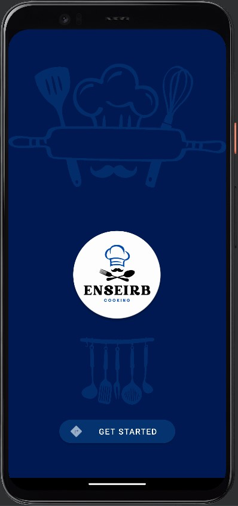
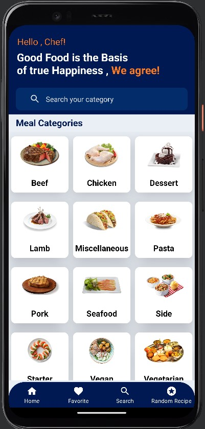
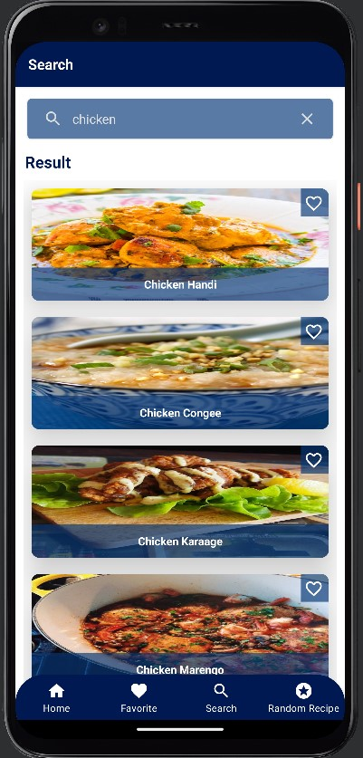

# Projet Mobile

**ENSEIRB Cooking**  est une application  qui permet aux utilisateurs de consulter des milliers de recettes. Cette application qui consomme l'API `The MealDB`, affiche les recettes de manière claire et organisée, et permet aux utilisateurs de filtrer les recettes selon plusieurs  catégories. Les utilisateurs pourront également enregistrer des recettes favorites pour une consultation ultérieure. Avec une interface conviviale et un accès facile à des milliers de recettes, ENSEIRB Cooking un outil incroyable pour les amateurs de cuisine de tous niveaux.

## Membres du groupe : 

Cette application est réalisée par le binome : 
- EL AMOUD Youssef
- MHIDOU Walid

## Logo de l'application

  

## Fonctionnalités développées : 

- On affiche une liste des catégories de recette.
- Lorsqu'on clique sur une catégorie, on affiche une liste des recettes associées à cette catégorie.
- Lorsqu'on choisit une recette, on affiche les détails suivants : 

  - Nom de la recette
  - Les ingrédients et leurs mesures
  - Un lien vers la vidéo Youtube si elle existe
 
 - L'utilisateur peut ajouter une recette à ces favoris.

- L'utilisateur peut recevoir une recette aléatoire. 
- L'utilisateur peut rechercher une catégorie.
- L'utilisateur peut filtrer selon un ingrédient.

## Les branches de développement :

## Captures d'écran de l'Interface Utilisateur : 

- Page d'acceuil, on clique sur **Get Started** pour commencer : 

  

- L'application en train de récupérer les catégories :

  

- Toutes les catégories ont été chargées avec succès :

  

- Les recettes associées à la catégorie choisie : 

  

- Collection des favoris :

  

- Une recette aléatoire : 

  

- Recherche par catégorie : 

  

- Recherche par ingrédient : 

  

## Difficultés Rencontrées :

